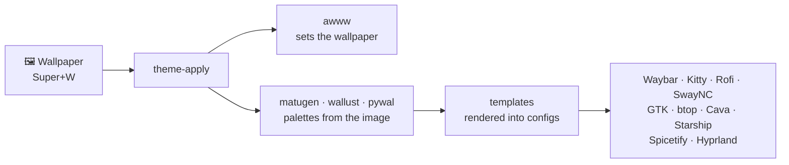

<div align="center">

# ❄️ YaneConfigHyprland

**Arch Linux + Hyprland** rice with full dynamic theming —
change the wallpaper and *everything* recolors itself.


**English** | [Русский](README.ru.md)

</div>


Same setup, different wallpapers — everything recolors automatically:

|  |  |
|---|---|

<details>
<summary>📸 More screenshots</summary>

**Rofi launcher** (`Super+Space`)


**Lock screen** (Hyprlock, `Super+L`)


**SwayNC control center**


**Wallpaper picker** (`Super+W`) — changes the colors of everything


**Waybar style menu** (`Super+Shift+W`)


**Power menu** (`Super+Shift+M`)


**Yazi file manager**


**Clean desktop**


</details>

## Stack

| | |
|---|---|
| 🪟 **WM** | [Hyprland](https://hypr.land) 0.55+ — Lua config (`hyprland.lua` + modules) |
| 📊 **Bar** | Waybar (5 switchable styles) + Eww music widget |
| 🖥️ **Terminal** | Kitty · Starship prompt · Fastfetch |
| 🚀 **Launcher & menus** | Rofi (launcher, power menu, wallpaper picker) |
| 🔔 **Notifications** | SwayNC control center |
| 🔒 **Lock & login** | Hyprlock · SDDM (winter theme with video background) |
| 🎨 **Theming** | matugen + wallust + pywal → templates for every app |
| 🖼️ **Wallpapers** | awww daemon · 31 wallpapers included |
| 🌙 **Night light** | Hyprsunset |
| 🎵 **Music** | Spotify + Spicetify (auto-themed) · Cava visualizer |
| 📁 **Files & monitoring** | Yazi (TUI) · Thunar (GUI) · btop |

## How the theming works



One hotkey — and a couple of seconds later the bar, notifications, terminal, GTK apps and even Spotify
match the new wallpaper. Waybar styles (5 presets) switch independently: `Super+Shift+W`.
The detailed chain is in [docs/FULL-GUIDE.en.txt](docs/FULL-GUIDE.en.txt), section 14.

## Installation

> Targets a clean Arch Linux. The script **backs up** existing configs to
> `~/.config-backup-<date>` before replacing anything.

```bash
git clone https://github.com/Yaneart/YaneConfigHyprland.git
cd YaneConfigHyprland
./install.sh
```

Unattended install: `./install.sh --yes` — answers "yes" to everything and runs pacman/yay with `--noconfirm`.

The script asks for confirmation at every step:
1. Packages from the official repos (`packages-pacman.txt`)
2. AUR packages via yay (`packages-aur.txt`) — installs yay itself if missing
3. Backup and copy of configs into `~/.config`, scripts into `~/.local/bin`, wallpapers
4. Hardcoded path replacement (`/home/yaneart` → your `$HOME`)
5. Starship hook in `~/.bashrc`
6. SDDM login theme
7. Services (NetworkManager, bluetooth, SDDM)
8. Spicetify (optional)
9. Applying the theme

After installation, log into the **Hyprland** session via SDDM.

**Worth knowing during install:**
- **Hyprland 0.55+ is required** — the config is Lua, the legacy `.conf` format is not used.
- **Package conflicts are normal**: `waybar-cava` replaces plain `waybar`,
  `pipewire-pulse` replaces `pulseaudio` — answer "yes" when pacman asks.
- **Spotify** must be launched at least once before configuring Spicetify
  (the installer detects this and tells you).
- **Bash only**: Starship is hooked into `~/.bashrc`; for zsh/fish add the
  equivalent init line yourself. Everything else works regardless of shell.

### Manual installation

```bash
cp -a config/* ~/.config/
cp -a bin/* ~/.local/bin/ && chmod +x ~/.local/bin/*
cp -a wallpapers ~/.config/wallpapers
# replace hardcoded paths:
grep -rl '/home/yaneart' ~/.config/{hypr,waybar,waypaper} | xargs sed -i "s|/home/yaneart|$HOME|g"
echo 'eval "$(starship init bash)"' >> ~/.bashrc
~/.local/bin/theme-apply ~/.config/wallpapers/arch-blue-waves.png
```

<details>
<summary>⚙️ Hardware notes & quirks</summary>

- **Hardware.** Made for a ThinkPad T480 (1920×1080, Intel graphics). On other resolutions
  Hyprland adapts by itself; monitor settings live in `config/hypr/modules/monitors.lua`.
  On NVIDIA you may need extra env variables (the usual Hyprland story) —
  `WLR_NO_HARDWARE_CURSORS=1` is already set.
- **Keyboard layout** is hardcoded to `us,ru` with Alt+Shift toggle —
  change one line in `config/hypr/modules/input.lua` if you need something else.
- **`hyprctl dispatch`** uses Lua syntax as well (Hyprland 0.55+), e.g. window closing
  goes through `hl.dsp.window.close()` — the scripts already account for this.

</details>

## Keybindings (essentials)

| Keys | Action |
|---|---|
| `Super + Enter` | Kitty terminal |
| `Super + Space` | launcher (Rofi) |
| `Super + Q` | close window |
| `Super + W` | wallpaper picker (changes the theme) |
| `Super + Alt + W` | random wallpaper + theme |
| `Super + Shift + W` | Waybar style menu |
| `Super + Shift + C` | regenerate colors |
| `Super + L` | lock screen (hyprlock) |
| `Super + S` | night light (hyprsunset) |
| `Super + B / C / V / E` | Firefox / Telegram / VS Code / Thunar |
| `Super + Shift + M` | power menu |
| `Super + 1–0` | workspaces |
| `Print` / `Ctrl+Print` / `Alt+Print` | screenshot: screen / area / area→Swappy |

Full list — [docs/FULL-GUIDE.en.txt](docs/FULL-GUIDE.en.txt) (section 13).

## Under the hood

Main scripts: `theme-apply`, `theme-random`, `wallset`, `waybar-set`, `colorscheme-set` —
the rest are below.

<details>
<summary>🧰 All scripts (<code>bin/</code>)</summary>

| Script | What it does |
|---|---|
| `theme-apply ` | wallpaper + full color regeneration for everything |
| `theme-random` | random wallpaper + theme |
| `theme-restore` | restore the last theme (runs on autostart) |
| `wallset` | Rofi wallpaper picker with previews |
| `waybar-set` / `waybar-menu` | switch Waybar styles and configs |
| `colorscheme-set` | regenerate colors without changing the wallpaper |
| `launcher` | Rofi launcher |
| `close-window` / `close_all_windows` | graceful window closing (SIGTERM follow-up) |
| `kitty-dashboard` | Kitty with the fastfetch dashboard |
| `toggle-hyprsunset` | night light on/off |
| `pywal_cava` | pywal colors for cava |

</details>

<details>
<summary>🗂️ Repository layout</summary>

```
config/          configs for ~/.config (hypr, waybar, kitty, cava, rofi, swaync,
                 matugen, wallust, eww, spicetify, fastfetch, btop, gtk, qt, …)
bin/             scripts for ~/.local/bin (theme-apply, waybar-set, wallset, …)
sddm/            login screen theme (winter, video background) + /etc/sddm.conf.d config
wallpapers/      wallpaper collection (31)
docs/            FULL-GUIDE.en.txt / FULL-GUIDE.ru.txt — in-depth documentation
packages-*.txt   package lists (pacman / AUR)
install.sh       installer
```

</details>

---

<div align="center">

Every component, every script and the whole theming chain explained in detail —
**[docs/FULL-GUIDE.en.txt](docs/FULL-GUIDE.en.txt)** ([русская версия](docs/FULL-GUIDE.ru.txt))

⭐ **Star the repo if you like the rice** ⭐

</div>
