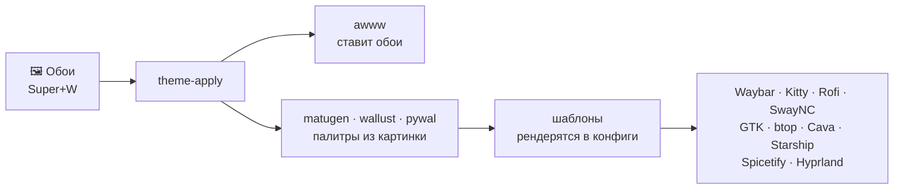

<div align="center">

# ❄️ YaneConfigHyprland

Райс **Arch Linux + Hyprland** с полной динамической темизацией —
меняешь обои, и *всё* окружение перекрашивается само.


[English](README.md) | **Русский**

</div>


Тот же сетап, другие обои — всё перекрашивается автоматически:

|  |  |
|---|---|

<details>
<summary>📸 Больше скриншотов</summary>

**Rofi launcher** (`Super+Space`)


**Экран блокировки** (Hyprlock, `Super+L`)


**Центр уведомлений SwayNC**


**Выбор обоев** (`Super+W`) — перекрашивает всё окружение


**Меню стилей Waybar** (`Super+Shift+W`)


**Меню питания** (`Super+Shift+M`)


**Музыкальный виджет Spotify** (Eww + mpris в Waybar, `Super+P`)


**Файловый менеджер Yazi**


**Чистый рабочий стол**


</details>

## Стек

| | |
|---|---|
| 🪟 **WM** | [Hyprland](https://hypr.land) 0.55+ — конфиг на Lua (`hyprland.lua` + модули) |
| 📊 **Панель** | Waybar (5 переключаемых стилей) + музыкальный виджет Eww |
| 🖥️ **Терминал** | Kitty · промпт Starship · Fastfetch |
| 🚀 **Launcher и меню** | Rofi (запуск, меню питания, выбор обоев) |
| 🔔 **Уведомления** | центр уведомлений SwayNC |
| 🔒 **Блокировка и вход** | Hyprlock · SDDM (тема winter с видео-фоном) |
| 🎨 **Темизация** | matugen + wallust + pywal → шаблоны для каждой программы |
| 🖼️ **Обои** | демон awww · 31 обоина в комплекте |
| 🌙 **Ночной режим** | Hyprsunset |
| 🎵 **Музыка** | Spotify + Spicetify (перекрашивается сам) · визуализатор Cava |
| 📁 **Файлы и мониторинг** | Yazi (TUI) · Thunar (GUI) · btop |

## Как работает темизация



Один хоткей — и через пару секунд панель, уведомления, терминал, GTK-приложения и даже Spotify
подстроены под новые обои. Стили Waybar (5 пресетов) переключаются отдельно: `Super+Shift+W`.
Подробная схема цепочки — в [docs/FULL-GUIDE.ru.txt](docs/FULL-GUIDE.ru.txt), раздел 14.

## Установка

> Рассчитано на чистый Arch Linux. Скрипт **бэкапит** существующие конфиги в
> `~/.config-backup-<дата>` перед заменой.

```bash
git clone https://github.com/Yaneart/YaneConfigHyprland.git
cd YaneConfigHyprland
./install.sh
```

Установка без вопросов: `./install.sh --yes` — отвечает «да» на всё, pacman/yay идут с `--noconfirm`.

Скрипт спросит подтверждение на каждый шаг:
1. Пакеты из официальных репозиториев (`packages-pacman.txt`)
2. Пакеты из AUR через yay (`packages-aur.txt`) — поставит yay, если его нет
3. Бэкап и копирование конфигов в `~/.config`, скриптов в `~/.local/bin`, обоев
4. Замена захардкоженных путей (`/home/yaneart` → твой `$HOME`)
5. Подключение starship в `~/.bashrc`
6. Тема SDDM
7. Сервисы (NetworkManager, bluetooth, SDDM)
8. Docker (socket-активация — демон стартует при первом обращении, + группа docker)
9. Spicetify (опционально)
10. Применение темы

После установки — войти в сессию **Hyprland** через SDDM.

**Полезно знать при установке:**
- **Hyprland 0.55+ обязателен** — конфиг на Lua, старый `.conf`-формат не используется.
- **Конфликты пакетов — это нормально**: `waybar-cava` заменяет обычный `waybar`,
  `pipewire-pulse` заменяет `pulseaudio` — отвечай «да», когда pacman спросит.
- **Spotify** надо запустить хотя бы раз до настройки Spicetify
  (установщик это понимает и подскажет).
- **Только bash**: Starship подключается в `~/.bashrc`; для zsh/fish добавь
  соответствующую init-строку сам. Всё остальное от шелла не зависит.

### Ручная установка

```bash
cp -a config/* ~/.config/
cp -a bin/* ~/.local/bin/ && chmod +x ~/.local/bin/*
cp -a wallpapers ~/.config/wallpapers
# заменить захардкоженные пути:
grep -rl '/home/yaneart' ~/.config/{hypr,waybar,waypaper} | xargs sed -i "s|/home/yaneart|$HOME|g"
echo 'eval "$(starship init bash)"' >> ~/.bashrc
~/.local/bin/theme-apply ~/.config/wallpapers/arch-blue-waves.png
```

<details>
<summary>⚙️ Железо и тонкости</summary>

- **Железо.** Делалось под ThinkPad T480 (1920×1080, графика Intel). На других разрешениях
  Hyprland подстроится сам; настройки мониторов — в `config/hypr/modules/monitors.lua`.
  На NVIDIA могут понадобиться дополнительные env-переменные (классика Hyprland) —
  `WLR_NO_HARDWARE_CURSORS=1` уже стоит.
- **Раскладка клавиатуры** захардкожена: `us,ru`, переключение Alt+Shift —
  меняется одной строчкой в `config/hypr/modules/input.lua`.
- **`hyprctl dispatch`** тоже на Lua-синтаксисе (Hyprland 0.55+), например закрытие окна —
  через `hl.dsp.window.close()`; в скриптах это уже учтено.

</details>

## Горячие клавиши (основные)

| Клавиши | Действие |
|---|---|
| `Super + Enter` | терминал Kitty |
| `Super + Space` | launcher (Rofi) |
| `Super + Q` | закрыть окно |
| `Super + W` | выбор обоев (меняет тему) |
| `Super + Alt + W` | случайные обои + тема |
| `Super + Shift + W` | меню стилей Waybar |
| `Super + Shift + C` | перегенерировать цвета |
| `Super + L` | блокировка (hyprlock) |
| `Super + S` | ночной режим (hyprsunset) |
| `Super + B / C / V / E` | Firefox / Telegram / VS Code / Thunar |
| `Super + P` | Spotify (тема Spicetify + музыкальный виджет Eww) |
| `Super + D` | lazydocker (TUI для Docker; демон поднимается сам) |
| `Super + Shift + M` | меню питания |
| `Super + 1–0` | воркспейсы |
| `Print` / `Ctrl+Print` / `Alt+Print` | скриншот: экран / область / область→Swappy |

Полный список — в [docs/FULL-GUIDE.ru.txt](docs/FULL-GUIDE.ru.txt) (раздел 13).

## Под капотом

Главные скрипты: `theme-apply`, `theme-random`, `wallset`, `waybar-set`, `colorscheme-set` —
остальные ниже.

<details>
<summary>🧰 Все скрипты (<code>bin/</code>)</summary>

| Скрипт | Что делает |
|---|---|
| `theme-apply ` | обои + полная регенерация цветов всего окружения |
| `theme-random` | случайные обои + тема |
| `theme-restore` | восстановить последнюю тему (вызывается в автостарте) |
| `wallset` | Rofi-меню выбора обоев с превью |
| `waybar-set` / `waybar-menu` | переключение стилей и конфигов Waybar |
| `colorscheme-set` | регенерация цветов без смены обоев |
| `launcher` | Rofi launcher |
| `close-window` / `close_all_windows` | мягкое закрытие окон (SIGTERM-добивание) |
| `kitty-dashboard` | Kitty с fastfetch-дашбордом |
| `toggle-hyprsunset` | ночной режим вкл/выкл |
| `pywal_cava` | цвета pywal для cava |

</details>

<details>
<summary>🗂️ Структура репозитория</summary>

```
config/          конфиги для ~/.config (hypr, waybar, kitty, cava, rofi, swaync,
                 matugen, wallust, eww, spicetify, fastfetch, btop, gtk, qt, …)
bin/             скрипты для ~/.local/bin (theme-apply, waybar-set, wallset, …)
sddm/            тема экрана входа (winter, видео-фон) + конфиг для /etc/sddm.conf.d
wallpapers/      коллекция обоев (31 шт.)
docs/            FULL-GUIDE.ru.txt / FULL-GUIDE.en.txt — подробная документация
packages-*.txt   списки пакетов (pacman / AUR)
install.sh       установщик
```

</details>

---

<div align="center">

Каждый компонент, каждый скрипт и вся цепочка темизации подробно описаны в
**[docs/FULL-GUIDE.ru.txt](docs/FULL-GUIDE.ru.txt)** ([english version](docs/FULL-GUIDE.en.txt))

⭐ **Поставь звезду, если райс зашёл** ⭐

</div>
