<div align="center">

# ❄️ YaneConfigHyprland

Райс **Arch Linux + Hyprland** с полной динамической темизацией —
меняешь обои, и *всё* окружение перекрашивается само.


[English](README.md) | **Русский**

</div>

---

## 📸 Скриншоты

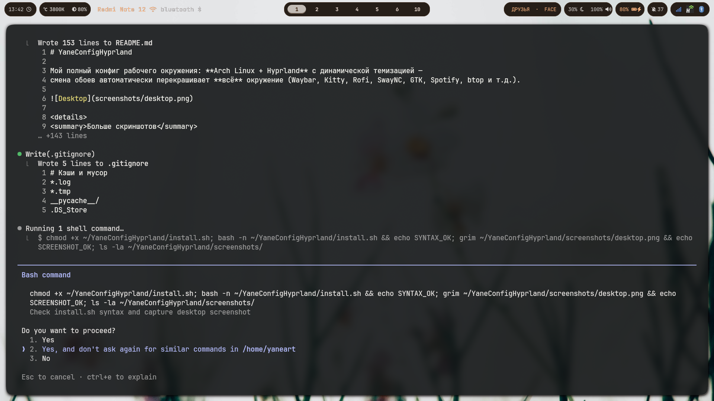

Тот же сетап, другие обои — всё перекрашивается автоматически:

| 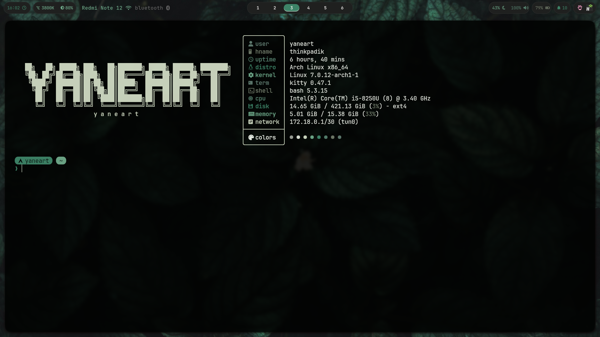 | 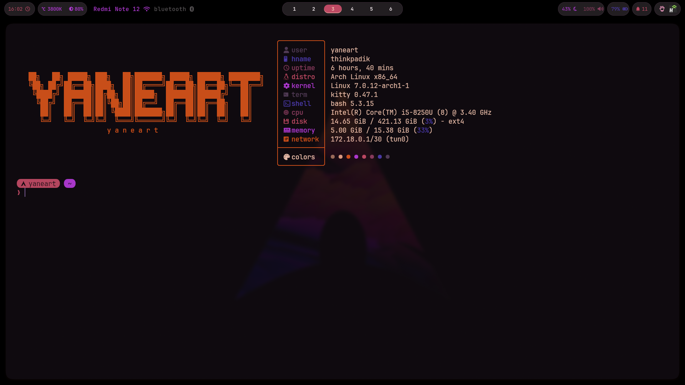 |
|---|---|

<details>
<summary><b>Больше скриншотов</b> — Rofi, экран блокировки, виджеты, меню…</summary>
<br>

**Rofi launcher** (`Super+Space`)
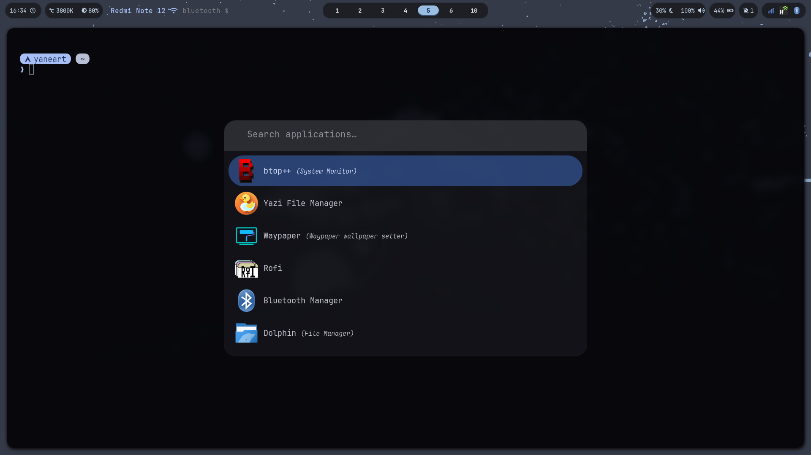

**Экран блокировки** (Hyprlock, `Super+L`)
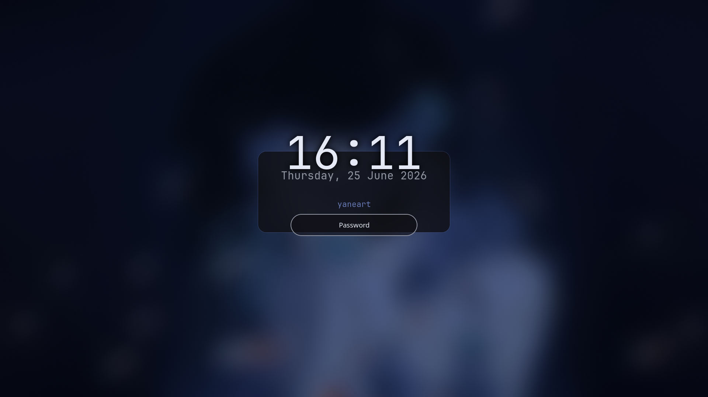

**Центр уведомлений SwayNC**
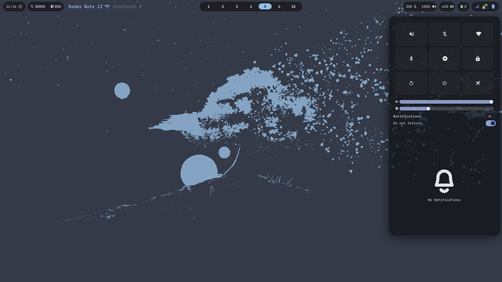

**Выбор обоев** (`Super+W`) — перекрашивает всё окружение
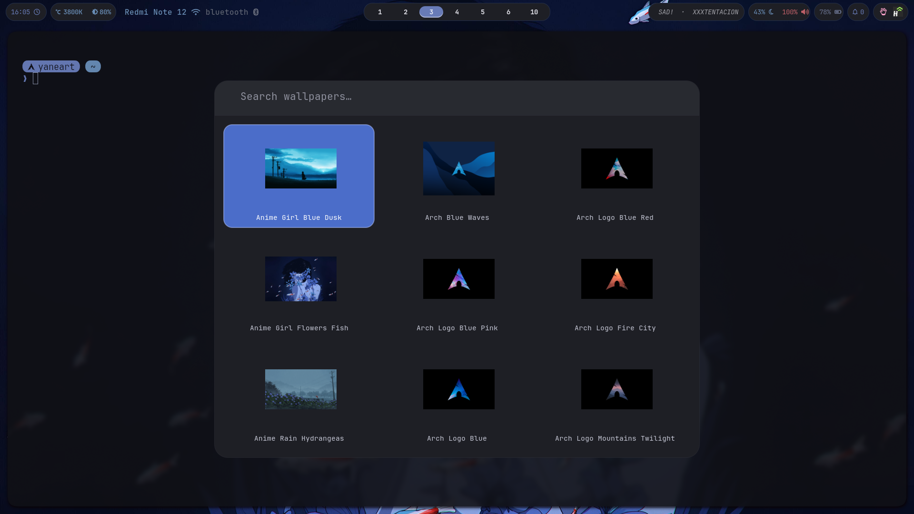

**Меню стилей Waybar** (`Super+Shift+W`)
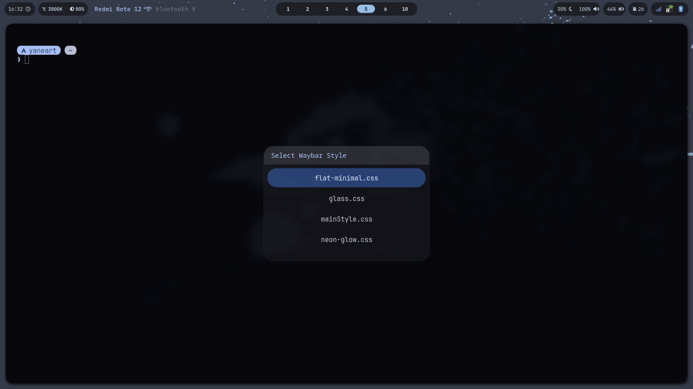

**Меню питания** (`Super+Shift+M`)
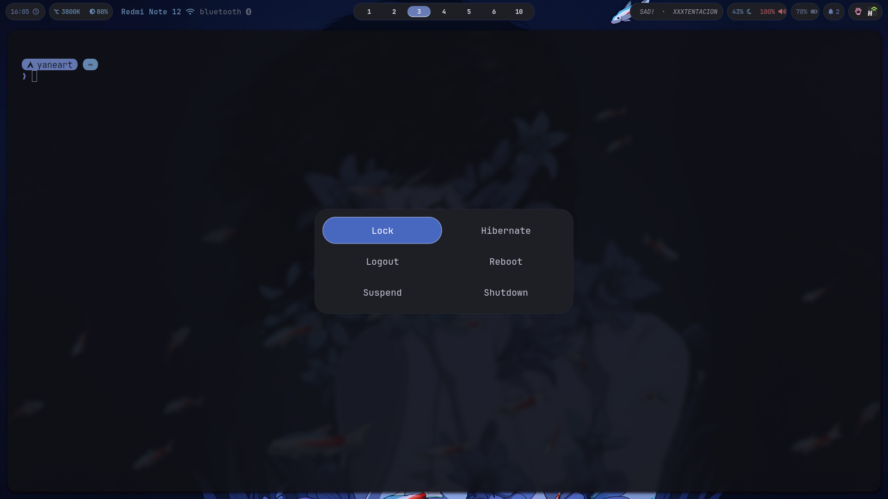

**Музыкальный виджет Spotify** (Eww + mpris в Waybar, `Super+P`)
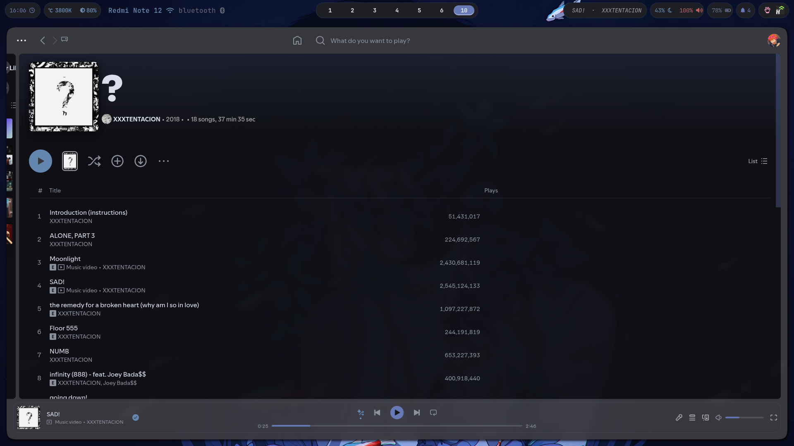

**Файловый менеджер Yazi**
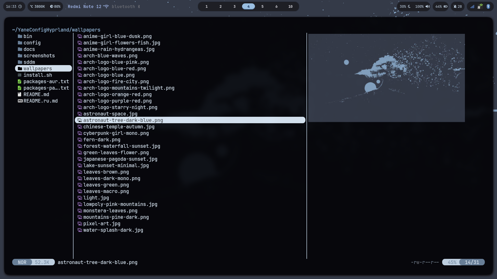

**Чистый рабочий стол**
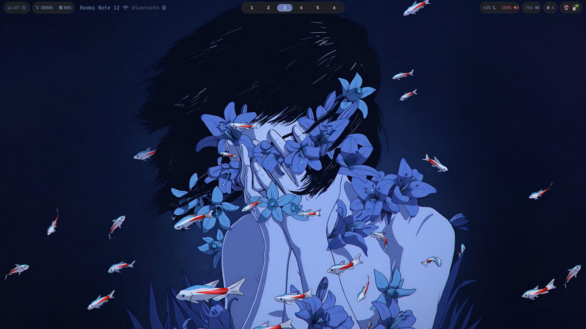

</details>

---

## 📦 Установка

> Рассчитано на чистый Arch Linux с **Hyprland 0.55+**. Скрипт **бэкапит**
> существующие конфиги в `~/.config-backup-<дата>` перед заменой.

```bash
git clone https://github.com/Yaneart/YaneConfigHyprland.git
cd YaneConfigHyprland
./install.sh
```

Скрипт спрашивает подтверждение на каждый шаг (пакеты, конфиги, тема SDDM,
сервисы, Spicetify, применение темы). Установка без вопросов: `./install.sh --yes`.
После установки — войти в сессию **Hyprland** через SDDM.

<details>
<summary><b>Полезно знать при установке</b></summary>
<br>

- **Hyprland 0.55+ обязателен** — конфиг на Lua, старый `.conf`-формат не используется.
- **Конфликты пакетов — это нормально**: `waybar-cava` заменяет обычный `waybar`,
  `pipewire-pulse` заменяет `pulseaudio` — отвечай «да», когда pacman спросит.
- **Spotify** надо запустить хотя бы раз до настройки Spicetify
  (установщик это понимает и подскажет).
- **Только bash**: Starship подключается в `~/.bashrc`; для zsh/fish добавь
  соответствующую init-строку сам. Всё остальное от шелла не зависит.

</details>

<details>
<summary><b>Ручная установка</b></summary>
<br>

```bash
cp -a config/* ~/.config/
cp -a bin/* ~/.local/bin/ && chmod +x ~/.local/bin/*
cp -a wallpapers ~/.config/wallpapers
# заменить захардкоженные пути:
grep -rl '/home/yaneart' ~/.config/{hypr,waybar,waypaper} | xargs sed -i "s|/home/yaneart|$HOME|g"
echo 'eval "$(starship init bash)"' >> ~/.bashrc
~/.local/bin/theme-apply ~/.config/wallpapers/arch-blue-waves.png
```

</details>

<details>
<summary><b>Железо и тонкости</b></summary>
<br>

- **Железо.** Делалось под ThinkPad T480 (1920×1080, графика Intel). На других разрешениях
  Hyprland подстроится сам; настройки мониторов — в `config/hypr/modules/monitors.lua`.
  На NVIDIA могут понадобиться дополнительные env-переменные (классика Hyprland) —
  `WLR_NO_HARDWARE_CURSORS=1` уже стоит.
- **Раскладка клавиатуры** захардкожена: `us,ru`, переключение Alt+Shift —
  меняется одной строчкой в `config/hypr/modules/input.lua`.

</details>

---

## ⌨️ Горячие клавиши

| Клавиши | Действие |
|---|---|
| `Super + Enter` | терминал Kitty |
| `Super + Space` | launcher (Rofi) |
| `Super + Q` | закрыть окно |
| `Super + W` | выбор обоев (меняет тему) |
| `Super + Alt + W` | случайные обои + тема |
| `Super + Shift + W` | меню стилей Waybar |
| `Super + Shift + C` | перегенерировать цвета |
| `Super + L` | блокировка (hyprlock) |
| `Super + S` | ночной режим (hyprsunset) |
| `Super + B / C / V / E` | Firefox / Telegram / VS Code / Thunar |
| `Super + P` | Spotify (тема Spicetify + музыкальный виджет Eww) |
| `Super + D` | lazydocker (TUI для Docker; демон поднимается сам) |
| `Super + Shift + M` | меню питания |
| `Super + 1–0` | воркспейсы |
| `Print` / `Ctrl+Print` / `Alt+Print` | скриншот: экран / область / область→Swappy |

---

<div align="center">

## 📖 Полный гайд

Стек, каждый компонент, каждый скрипт, полный список хоткеев
и вся цепочка темизации — подробно описаны в
**[docs/FULL-GUIDE.ru.txt](docs/FULL-GUIDE.ru.txt)** ([english version](docs/FULL-GUIDE.en.txt))

⭐ **Поставь звезду, если райс зашёл** ⭐

</div>
